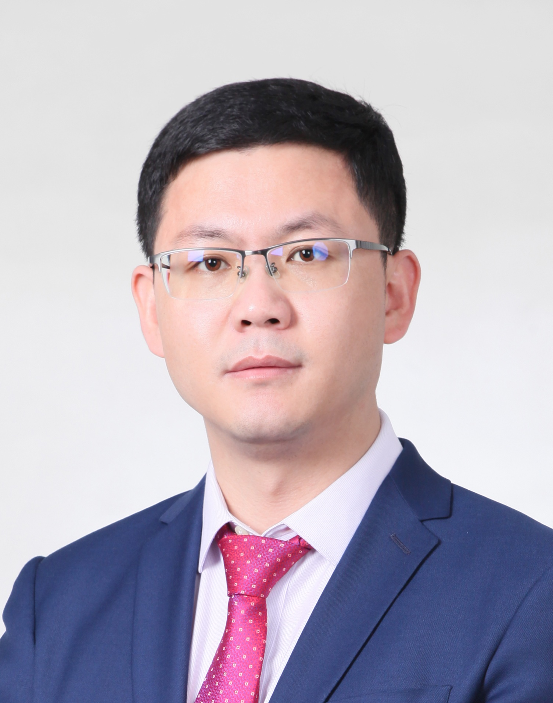

---
layout: about
title: Home
permalink: /
#subtitle: <a href='https://www.sjtu.edu.cn/'>Shanghai Jiao Tong University</a>. School of Automation and Intelligent Sensing. Tenured Track Associate Professor.
<!DOCTYPE html>
<html lang="en">
<head>
    <meta charset="UTF-8">
    <meta name="viewport" content="width=device-width, initial-scale=1.0">
    <title>Wei Liu's Homepage</title>
    
</head>
<body>
    <h1>Wei Liu's Homepage</h1>
    

    <!-- 头像与个人信息 -->
    
    

        <h3>Dr. Wei Liu</h3>
        
<strong>Associate Professor, PhD Supervisior</strong>

        
2-428 of SEIEE Buildings, <a href="https://www.sjtu.edu.cn/">Schoole of Automation and Intelligent Sensing</a>,<a href="https://www.sjtu.edu.cn/">Shanghai Jiao Tong University</a> 
        800 Dongchuan Road, Shanghai, P. R. China

        
<strong>Email:</strong> weiliucv(at)sjtu.edu.cn

        
<a href="https://scholar.google.com/citations?user=Vbb5EGIAAAAJ&hl=zh-CN">Google Scholar</a> | <a href="https://github.com/wliusjtu">Github</a>

    

    

 <!-- 清除浮动 -->

    <!-- 招生提示 -->
    

        Looking for self-motivated graduate students and post-docs working with me. For prospective students, please send your resume and transcript to my email.
    

    <!-- 个人简介 -->
    <h2>Biography</h2>
    
I am an associate professor in Shanghai Jiao Tong University. Prior to joining Shanghai Jiao Tong University in 2022, I was a postdoc researcher in the Hong Kong University working with professor <a href="https://www.math.hkbu.edu.hk/~mng/">Michael Ng</a> during 2021 to 2022, and The University of Adelaide woring with professor <a href="https://cshen.github.io/">Chunhua Shen</a> and professor <a href="https://cs.adelaide.edu.au/~ianr/index.php">Ian Reid</a> during 2018 to 2021. I got my Ph.D degree from Shanghai Jiao Tong University in 2018 and the bachelor's degress from Xi'an Jiao Tong University in 2012. I was a joint-training Ph.D student at The University of Adelaide from 2017 to 2018. 

    
I am working on computer vision problems. Especially in the field

    <ul>
        <li>image restoration and enhancement</li>
        <li>3D reconstruction </li>
        <li>self-supervised depth estimation</li>
        <li>vision problems for autonomous driving</li>
        <li>multi-modal understanding (vision and language)</li>
    </ul>

    <!-- 亮点与新闻 -->
    <h2>Highlights and News</h2>
    <ul>
        <li>11/2025, one paper gets acceptted to AAAI 2025</li>
    </ul>

</body>
</html>
# profile:
#   align: right
#   image: prof_pic.png
#   image_circular: false # crops the image to make it circular
#   more_info: >
#     <b>Dr. Wei Liu</b>
#     <b>Associate Professor, Ph.D Supervisor</b>
#     
<b>Office</b>: Room 2-428, SEIEE Building

#     
Shanghai Jiao Tong University

#     
<b>Email:</b> weiliucv@sjtu.edu.cn

#     
<a href="https://scholar.google.com/citations?user=Vbb5EGIAAAAJ&hl=zh-CN" target="_blank"><b>Google Scholar</b></a>

# selected_papers: false # includes a list of papers marked as "selected={true}"
# social: false # includes social icons at the bottom of the page

# announcements:
#   enabled: false # includes a list of news items
#   scrollable: true # adds a vertical scroll bar if there are more than 3 news items
#   limit:  # leave blank to include all the news in the `_news` folder

# latest_posts:
#   enabled: false
#   # scrollable: true # adds a vertical scroll bar if there are more than 3 new posts items
#   # limit: 3 # leave blank to include all the blog posts
# ---

# ## Research Domains

# **3D Reconstruction, 3D Detection, Depth Estimation, Multimodal Large Models**

# I am a Tenured Track Associate Professor and Doctoral Supervisor at the School of Automation and Intelligent Sensing, Shanghai Jiao Tong University. My research focuses on computer vision, particularly in 3D reconstruction, 3D object detection, depth estimation, and multimodal large models.

# ## Work Experience

# - **2022 - Now**: Tenured Track Associate Professor / Doctoral Supervisor, Shanghai Jiao Tong University
# - **2021 - 2022**: Postdoctoral Researcher, The University of Hong Kong
# - **2018 - 2021**: Postdoctoral Researcher, The University of Adelaide

# ## Education

# - **2012 - 2019**: Ph.D. in Engineering, Shanghai Jiao Tong University
# - **2008 - 2012**: B.E. in Engineering, Xi'an Jiao Tong University